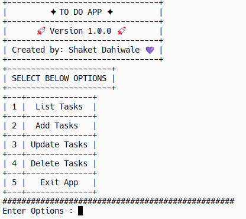
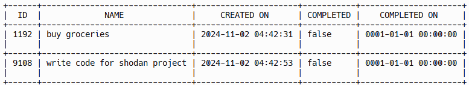
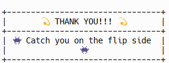

# 📟 Terminal Based To Do App

A sleek, terminal based To-Do app build with Go!
Perfect for those who love working in the command line and want a quick,no-fuss way to manage tasks.This app offers all essential task management fetaures in a minimalist, test-based environmnet🤩  


## 🛠️ Features

- Persistant sile Storage
- Date and Time support
- Easy to use UI
- Cross platform


## 📸 Screenshots






## ⚔️ Run Locally

🧪 Clone the project

```bash
  git clone https://github.com/Shaket123/Terminal-Based-To-Do-App
```

🔮 Go to the project directory

```bash
  cd Terminal-Based-To-Do-App
```

🤖 Start Application

```bash
  go run main.go
```


## 👨🏻‍🏫 Lessons Learned

- Project Structure
- CLI Design
- Error Management
- Persistant Storage
- Data Handeling


## 🤝 Contributing

There is no contributer yet. Want to be the first


## 🙋 Feedback

If you have any feedback, please reach out to us at shaketmadandahiwale111@gmail.com

